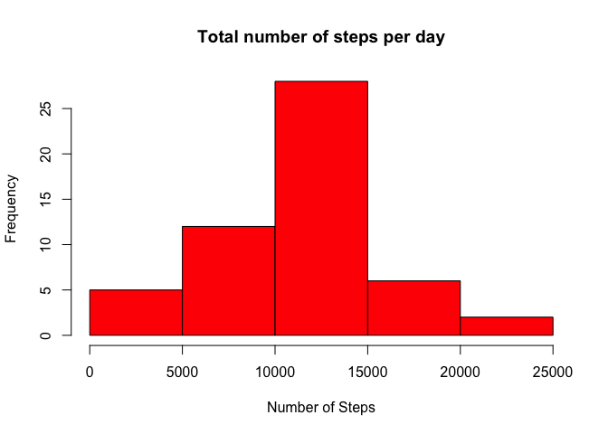
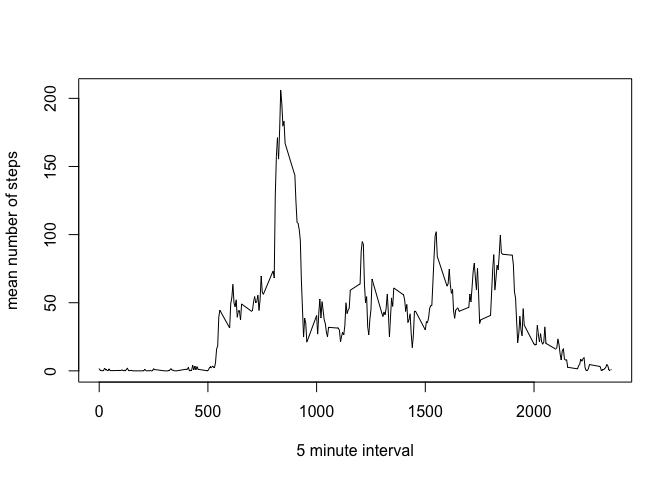
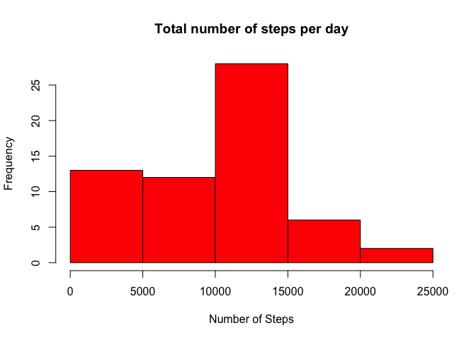
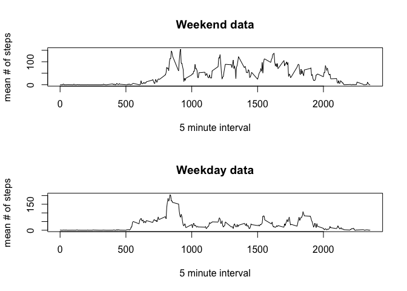

# Reproducible Research: Peer Assessment 1


## Loading and preprocessing the data

```r
library(data.table)
library(dplyr)
```

```
## 
## Attaching package: 'dplyr'
## 
## The following objects are masked from 'package:data.table':
## 
##     between, last
## 
## The following objects are masked from 'package:stats':
## 
##     filter, lag
## 
## The following objects are masked from 'package:base':
## 
##     intersect, setdiff, setequal, union
```

```r
rm(list=ls())
setwd("~/Desktop/Coursera/R/Reproducible Research/HW1/RepData_PeerAssessment1")
unzip(zipfile = "activity.zip", overwrite = TRUE)
data<-read.csv("activity.csv")
```

## What is mean total number of steps taken per day?

```r
summaryData<-data %>% group_by(date) %>% summarize(totalSteps=sum(steps))
medianNumStepsPerDay<-median(summaryData$totalSteps, na.rm=TRUE)
meanNumStepsPerDay<-mean(summaryData$totalSteps, na.rm=TRUE)
hist(as.numeric(summaryData$totalSteps), col="red", main="Total number of steps per day", xlab="Number of Steps")
```

 

The mean number of steps per day was 1.0766189\times 10^{4} and the median was 10765


## What is the average daily activity pattern?

```r
lData<-data %>% group_by(interval) %>% summarize(meanSteps=mean(steps, na.rm=TRUE))
plot.ts(lData$interval, lData$meanSteps, type='l',xlab='5 minute interval', ylab='mean number of steps')
```

 

```r
#get interval with highest mean step count
maxInterval=lData[which.max(lData$meanSteps),]
```

The interval with the highest mean number of step is 835, 206.1698113

## Imputing missing values

```r
numberOfRecordsMissing<-sum(is.na(data$steps))
medianData<-data %>% group_by(interval) %>% summarize(medianSteps=median(steps, na.rm=TRUE))

for(i in 1:nrow(data))
{
  if(is.na(data[i,]$steps))
  {
    data[i,]$steps <- medianData[medianData$interval==data[i,]$interval,]$medianSteps
  }
}

summaryData<-data %>% group_by(date) %>% summarize(totalSteps=sum(steps), meanSteps=mean(steps))
medianNumStepsPerDay<-median(summaryData$totalSteps, na.rm=TRUE)
meanNumStepsPerDay<-mean(summaryData$totalSteps, na.rm=TRUE)
hist(as.numeric(summaryData$totalSteps), col="red", main="Total number of steps per day", xlab="Number of Steps")
```

 

With the NA's removed the mean number of steps per day was 9503.8688525 and the median was 10395

## Are there differences in activity patterns between weekdays and weekends?

```r
data$day<-weekdays(as.Date(data$date))
weekend<-subset(data, data$day=='Saturday' | data$day=='Sunday')
weekdays<-subset(data, data$day!='Saturday' & data$day!='Sunday')
summaryWeekend<-weekend %>% group_by(interval) %>% summarize(totalSteps=sum(steps), meanSteps=mean(steps))
summaryWeekdays<-weekdays %>% group_by(interval) %>% summarize(totalSteps=sum(steps), meanSteps=mean(steps))

medianNumStepsPerWeekend<-median(summaryWeekend$totalSteps)
meanNumStepsPerWeekend<-mean(summaryWeekend$totalSteps)

medianNumStepsPerWeekdays<-median(summaryWeekdays$totalSteps)
meanNumStepsPerWeekdays<-mean(summaryWeekdays$totalSteps)

par(mfrow=c(2,1))
plot.ts(summaryWeekend$interval, summaryWeekend$meanSteps, type='l',xlab='5 minute interval', ylab='mean # of steps', main='Weekend data')

plot.ts(summaryWeekdays$interval, summaryWeekdays$meanSteps, type='l',xlab='5 minute interval', ylab='mean # of steps', main='Weekday data')
```

 

